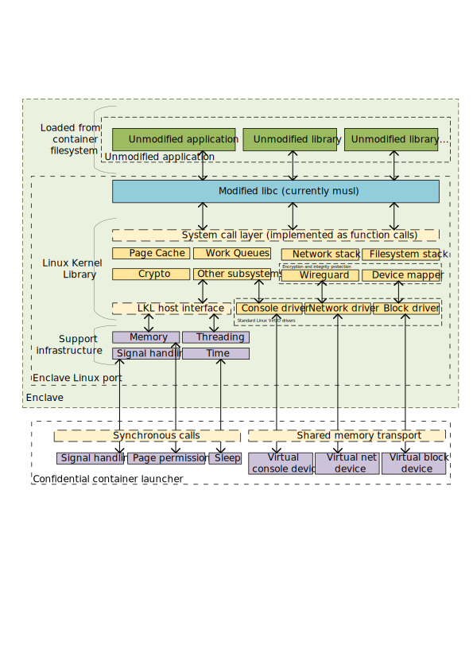

SGX-LKL System Architecture
===========================

This project provides several components targeted at running programs and their dependencies in enclaves:

 - An enclave runtime built on top of Open Enclave and VirtIO virtual devices for launching an operating system that runs inside an enclave.
 - A port of Linux to run in this environment.
 - Tools for turning Linux containers into *confidential containers*, which contain encrypted and/or integrity-protected Linux file systems with the contents of the original container.

The diagram below shows the overall architecture of the first two of these components:

The launcher
------------

The launcher (`sgx-lkl-run`) is a normal userspace program using [Open Enclave](https://openenclave.io/sdk/) to manage creation of an enclave.
This creates an enclave, loads the OS image into it, and provides the kind of services that would normally be provided by a hypervisor such as block and network devices, time, and so on.
The [interface by which this communicates with the in-enclave component is documented](HostInterface.md).

Enclave services
----------------

There are a number of generic services provided for in-enclave operating systems.
Most of these are in [src/enclave](../src/enclave), though the threading library has its own directory.

### Cooperative threading library

SGX does not provide a mechanism for scheduling timer interrupts from within an enclave and so it is not possible to efficiently implement preemptive multitasking.
Instead, we provide a cooperative threading environment (`lthreads`).
This is based on the [lthread](https://github.com/halayli/lthread) library.
Most higher-level code cooperates with this library via a [futex implementation](../src/sched/futex.c).
This is intended to be compatible with the Linux futex implementation.
When a thread waits on a futex, it is descheduled until the futex is signalled or a timeout occurs.

### Signal (trap) delivery

Open Enclave provides an abstraction based on Windows' vectored exceptions.
The exception code in [`src/enclave/enclave_signal.c`](../src/enclave/enclave_signal.c) provides a callback that allows these to be delivered as hardware traps.
It also provides emulation for some of the instructions that cannot be executed in enclaves, such as `cpuid` and `rdtsc`.

### Low-level memory management

The routines in [`src/enclave/enclave_mem.c`](../src/enclave/enclave_mem.c) provide low-level memory management, implementing a subset of the `mmap` family of interfaces.

Linux port
--------------

The majority of the initial in-enclave code is Linux, provided by the Linux Kernel Library (LKL).
This depends on a set of host services, which are implemented in [`src/lkl/posix-host.c`](../src/lkl/posix-host.c).

The code for initialising LKL and configuring the base environment is in [`src/lkl/setup.c`](../src/lkl/setup.c).
This includes registering the virtual devices provided via the host interface.

System call bypass
------------------

For historical reasons, the musl libc port bypasses the system call layer and calls directly into the enclave support code for a few functions.
This is due to some layering violations in the legacy code: parts of the code responsible for loading LKL depend on some libc features.
These features are provided by musl, and so we end up with a circular dependency: low-level components call musl, which calls into LKL, which may not yet be initialised (and if it is, would call into the low-level components).

This is gradually being removed, which will reduce musl changes that we have to carry forward.
